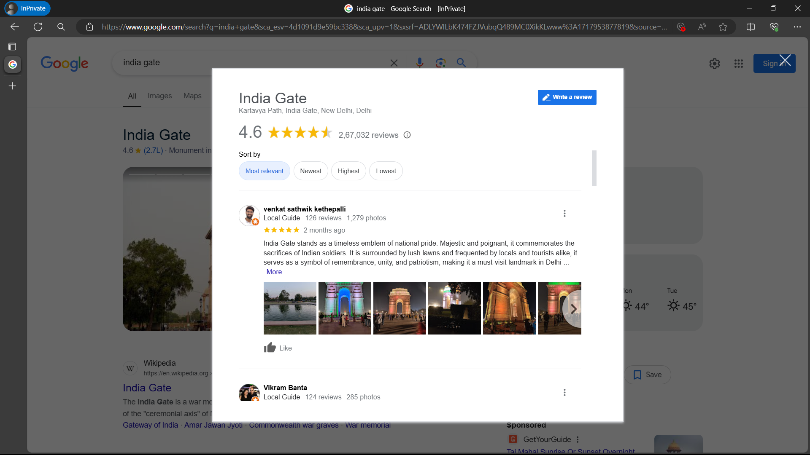
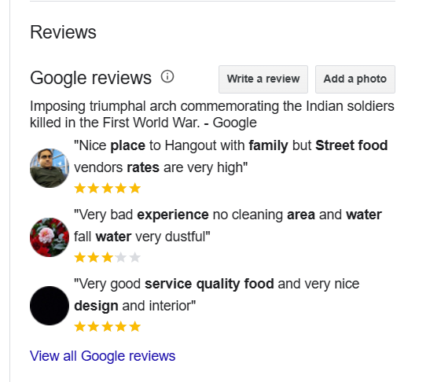

# Google Reviews Scrapper js
This is a simple Google Reviews Scrapper using `Puppeteer` and `Node.js`. It will scrape the reviews of a Google Place and save them in a JSON file.

[link to scrapper](http://ec2-3-89-33-160.compute-1.amazonaws.com:5500)

## Installation
1. Clone and set up the repository on your local machine
2. Run `npm install` to install the dependencies
3. Run `node index.js` to start the scrapper
4. Open `localhost:5500` on your browser and paste the Google Place URL
5. The reviews will be saved in a JSON file on your local machine

## Google Place URL
The Google Place URL should be a dialog box that shows the reviews of a place. For example, [this](https://www.google.com/search?q=india+gate&sca_esv=4d1091d9e59bc338&sca_upv=1&sxsrf=ADLYWILbK474FZJVubqQ489MC0XikKLwww%3A1717953877819&source=hp&ei=VeVlZq7LL8CdseMPs4q-kAw&iflsig=AL9hbdgAAAAAZmXzZbifuj_MESLityusWzUsavscgydK&ved=0ahUKEwjuyYD1hM-GAxXATmwGHTOFD8IQ4dUDCBU&uact=5&oq=india+gate&gs_lp=Egdnd3Mtd2l6IgppbmRpYSBnYXRlMgsQLhiABBjHARivATIFEAAYgAQyBRAAGIAEMgUQABiABDILEC4YgAQYxwEYrwEyBRAAGIAEMgUQABiABDIFEAAYgAQyBRAAGIAEMgUQABiABEizGlAAWKsZcAF4AJABAJgBogGgAYYPqgEEMC4xM7gBA8gBAPgBAZgCDqACtw-oAgrCAgoQIxiABBgnGIoFwgIEECMYJ8ICERAuGIAEGJECGNEDGMcBGIoFwgILEAAYgAQYkQIYigXCAhAQLhiABBjRAxhDGMcBGIoFwgIIEC4YgAQY1ALCAgsQLhiABBjRAxjHAcICChAuGIAEGEMYigXCAgoQABiABBhDGIoFwgIFEC4YgATCAgcQIxgnGOoCwgIHEC4YJxjqAsICEBAuGIAEGMcBGCcYigUYrwHCAggQABiABBjJA8ICCBAAGIAEGJIDmAMDkgcEMS4xM6AH1aUB&sclient=gws-wiz&lqi=CgppbmRpYSBnYXRlSOOaywFaFhABGAAYASIKaW5kaWEgZ2F0ZSoCCAKSAQhtb251bWVudKoBMhABMh4QASIaE-fxIulledJ4ejW8QcIXWFuWzwY4vlJpDRAyDhACIgppbmRpYSBnYXRl#lrd=0x390ce2daa9eb4d0b:0x717971125923e5d,1,,,,&rlimm=511043182630420061) is a Google Place URL.

### how to get this type of URL
1. Go to google.com in incognito mode
2. Search for the place you want to scrape reviews for
3. As you scroll down, you will see a `View all Google reviews` button. Click on it (check the image below)

    

4. A dialog box will open with all the reviews. Copy the URL of this dialog box from the browser's address bar. 
5. Paste this URL in the input field on the browser.
